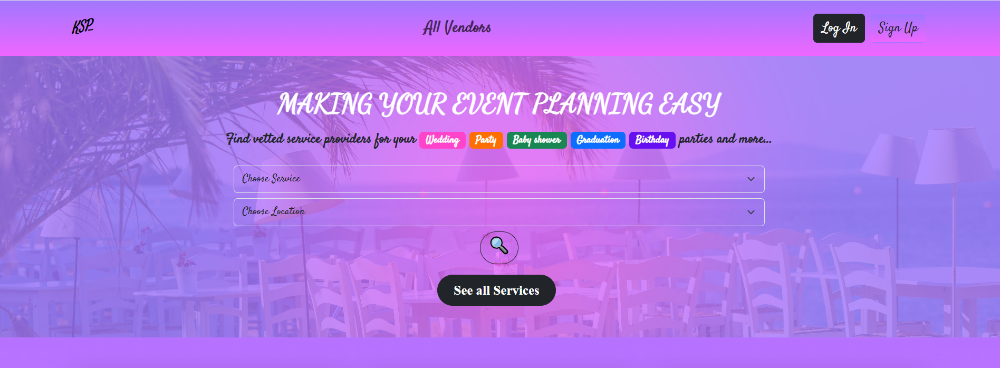
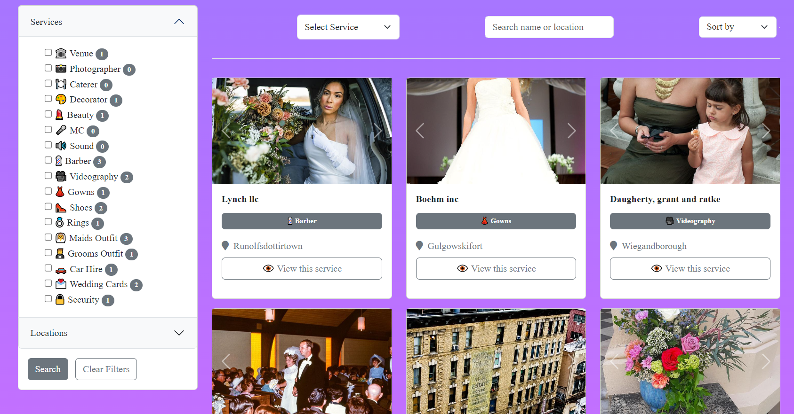
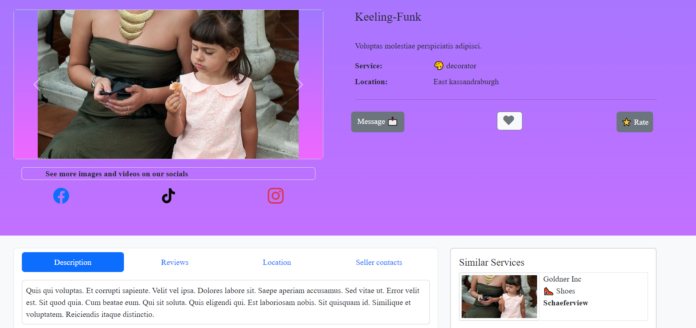

# README

This project is a directory for events vendors   with these features

* Allowing vendors to list their services

* Allowing clients browse / filter through various vendors

* Allow vendors  and clients communicate through in built messaging

* Allow clients to rate and review vendors

* Vendors can see stats of their services

* Admin can see users in the website 

* Admin can choose to charge vendors to publish their listing

## SCREENSHOTS 

# REQUIREMENTS
Project is a rails monolith with 
* Rails 7.0.6
* Postgresql 
* bootstrap 5
* Esbuild
# Getting Started 
 Clone repo  and run rails db:seed  to populate database with demo data